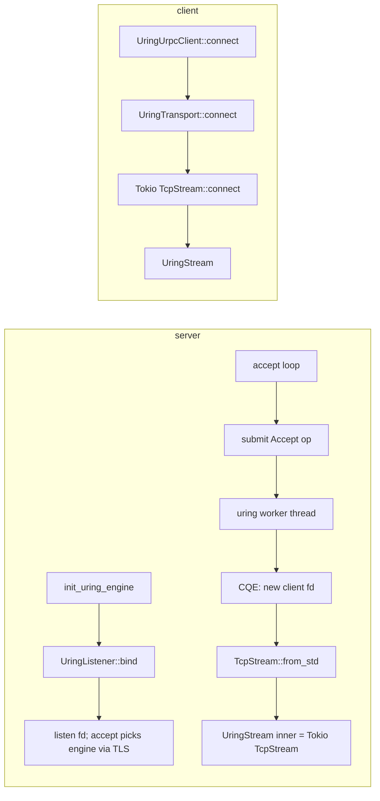

# RFC-01: urpc io-uring Transport

## 1. Background

`urpc` uses a `Transport` abstraction so upper layers (`Connection<S: TransportStream>`) stay independent of the I/O backend:

- **Default path**: `epoll` (Tokio `TcpListener` / `TcpStream`)
- **Linux optional path**: `io-uring` (Cargo feature: `io-uring`)

This document describes the **current** `io-uring` integration for **urpc network transport**. It does **not** cover disk I/O (`store/local/uring_io.rs`).

## 2. Design Goals

- Keep the `Transport` trait contract: `bind`, `connect`, `accept`, and stream `read` / `write` / `flush`.
- Avoid coupling protocol code to whether the listen side uses io_uring or epoll.
- Prefer **correctness and maintainability** over “full io_uring for every syscall” on the first shipping path.

## 3. Current Architecture (Hybrid)

### 3.1 Rationale

Earlier iterations submitted `IORING_OP_CONNECT`, `RECV`, and `SEND` through a **single** dedicated io_uring worker thread. That design hit practical issues: ordering between `Accept` and `Connect` on one ring, blocking `poll(2)` inside the worker during connect handshakes, and fragile interaction with Tokio-managed fds. The implementation was simplified to a **hybrid** model:

| Phase | Mechanism |
|-------|-----------|
| **Listen / accept** | One background thread owns `IoUring` and submits **`IORING_OP_ACCEPT`** only (multiplexed SQEs + `EAGAIN` resubmit). |
| **Connected socket I/O** | **`tokio::net::TcpStream`** — same as the epoll transport (`read_buf`, `write_all`, `read_exact`, `flush`). |
| **Outbound client connect** | **`tokio::net::TcpStream::connect`** — no io_uring worker involvement. |

So **io_uring is used where it was stable in practice (non-blocking accept on the listen fd)**; **Tokio handles established TCP streams**, matching the epoll path and avoiding duplicate complexity.

### 3.2 Module Responsibilities

Core code: `riffle-server/src/urpc/transport/uring.rs`

| Component | Responsibility |
|-----------|------------------|
| `UringTransport` | `Transport::bind` (std `TcpListener` + non-blocking listen fd), `Transport::connect` (Tokio `TcpStream::connect`). |
| `UringListener` | Holds `TcpListener` + listen `RawFd` + `Arc<UringNetEngine>`; `accept` submits **`Accept`** to the engine, then wraps the returned client fd in `TcpStream::from_std`. |
| `UringStream` | Wraps **`tokio::net::TcpStream`**; implements `TransportStream` by delegating to Tokio (`AsyncReadExt` / `AsyncWriteExt`), `SockRef` for keepalive/nodelay — aligned with `epoll.rs`. |
| `UringNetEngine` | `submit(op)` via `mpsc::SyncSender<UringOp>` to the worker thread. |
| **Worker** | Single thread: `IoUring`, multiplexed **`Accept`** loop (`HashMap` of pending ops by monotonic `user_data`, `submit_and_wait`, drain CQ, resubmit on `-EAGAIN`). |

There is **no** separate `UringWorker` type name in code; the loop is `uring_worker_loop`.

### 3.3 Component Diagram

```
┌─────────────────────────────────────────────────────────────────┐
│              Connection<S: TransportStream> (unchanged)            │
├─────────────────────────────────────────────────────────────────┤
│  Epoll path                    │  io-uring path (Linux + feature) │
│  EpollTransport / EpollStream  │  UringTransport / UringStream    │
│  (all Tokio TCP)               │  accept → io_uring; stream → Tokio│
└─────────────────────────────────────────────────────────────────┘
```

### 3.4 Server vs Client Flow



**Note:** The client does **not** call `init_uring_engine`; only the server process that binds the urpc listener needs the global engine for `Accept`.

## 4. Operation Lifecycle (Worker)

### 4.1 `UringOp` (listen path only)

- `op_type`: **`Accept`** — `listen_fd`, `sockaddr_storage`, `addrlen` (real buffers; not null), non-blocking listen socket.
- `tx`: `Option<oneshot::Sender<Result<i32>>>` — completion delivers the **new client fd** as a non-negative `i32`, or negative errno.

### 4.2 Submit Path

1. `UringListener::accept` builds `UringOp`, `UringNetEngine::submit` → `SyncSender` (bounded queue).
2. Worker `try_recv`s or blocking `recv` when idle, assigns monotonic `user_data`, pushes SQE, tracks `pending`.
3. `submit_and_wait(1)`, drain all CQEs; for `Accept` with `-EAGAIN` / `-EWOULDBLOCK`, re-push the same `Accept` SQE (same `user_data`).
4. On terminal result, `oneshot` sends `Ok(result)`; listener maps `result >= 0` to client fd → Tokio stream.

### 4.3 Errors

- Negative CQE results (other than would-block, handled inside the worker) propagate as `Err` from `accept`.
- Stream I/O errors follow Tokio/`anyhow` like epoll.

## 5. Threading and Concurrency

- **One** `IoUring` instance per **engine**: each engine runs in its own OS thread (`riffle-uring-net-{i}`) and optionally pins to `core_affinity::get_core_ids()[i]` when affinity is available (one logical core per engine for `i < core count`).
- **`UringEngineRegistry`** (`OnceCell`) holds a **`Vec` of `UringNetEngine`** — count from `init_uring_engine`: `threads == 0` means one engine per logical CPU (`logical_cpu_count` in `uring.rs`); `threads > 0` caps the pool size.
- **`thread_local` `URING_ENGINE_INDEX`**: used with `on_thread_start` in `rpc.rs` so Tokio worker threads pick a stable index; `get_engine()` maps that index to an `Arc` (modulo engine count).
- **Multiplexing** matters so one listener stuck in `Accept` `EAGAIN` does not prevent processing other submitted `Accept` completions on the same ring.

Legacy designs (e.g. `Arc<Mutex<Receiver>>` across multiple workers) are **not** present; the channel is **`mpsc::sync_channel`** feeding **one** consumer.

## 6. API and Integration

### 6.1 Server (`rpc.rs`)

When `io_uring_enable = true` (and feature + Linux):

1. `init_uring_engine(threads)` — initializes the global registry + one worker thread (and ring) per engine.
2. Spawn a thread with a Tokio multi-thread runtime (core affinity hook calls `set_current_engine_index`).
3. `UringListener::bind(0.0.0.0:urpc_port)` then `urpc::server::run_with_listener`.

### 6.2 Client (`urpc/client.rs`)

- `UringUrpcClient::connect` uses `UringTransport::connect` only — **no** `init_uring_engine` on the client.

### 6.3 `get_engine()`

- `pub(crate)` — used by `UringListener::accept` on the server side (per-call routing so each Tokio worker submits to its TLS-selected engine).

## 7. Configuration

### 7.1 Feature Gate

```toml
[features]
io-uring = ["dep:io-uring"]
```

### 7.2 Server Config Example

```toml
[urpc_config]
get_index_rpc_version = "V2"
io_uring_enable = true
io_uring_threads = 0    # 0 = one engine per logical CPU; >0 caps engine count
```

### 7.3 `UrpcConfig` Fields (urpc)

| Option | Type | Default | Description |
|--------|------|---------|-------------|
| `get_index_rpc_version` | `RpcVersion` | `V1` | RPC version |
| `io_uring_enable` | `bool` | `false` | Use urpc io-uring listen path (Linux + feature) |
| `io_uring_threads` | `usize` | `0` | `0` = one engine per logical CPU; `>0` = max engines |

## 8. Performance Notes (Realistic)

Because **bulk read/write** uses the same Tokio path as epoll, **large transfer and syscall reduction claims for io_uring apply mainly to the listen/accept side**, not to per-connection streaming. Any measured win should be validated under workloads that stress **accept rate** and connection churn.

## 9. Limitations and Follow-ups

- **Multiple rings** when `logical_cpu_count > 1` (or when capped by `io_uring_threads`); each ring stays single-threaded.
- **Hybrid design** is intentional; a **full** io_uring data path would need a careful design for connect completion, non-blocking recv/send lifetimes, and cancellation — likely separate rings or a more sophisticated scheduler.
- **`AsRawFd`**: `UringStream` disambiguates `std::os::fd::AsRawFd` vs the crate’s `transport::AsRawFd` trait for Tokio’s `TcpStream`.

## 10. Validation

```bash
cargo check -p riffle-server --features io-uring

# Integration tests (Linux + io-uring feature)
cargo test -p riffle-server --features io-uring --test write_read shuffle_write_read_testing_with_io_uring
cargo test -p riffle-server --features io-uring --test uring_simple
```

Recommended: compare behavior with epoll path under the same workload; monitor accept QPS and tail latency if tuning the listen path.

## 11. Possible Future Work

- Multiple `IoUring` instances / sharding if a single accept worker becomes a bottleneck.
- Revisit **full** `IORING_OP_RECV`/`SEND` (or `read`/`write`) on dedicated rings with clear ownership and cancellation semantics.
- Metrics: accept latency, worker queue depth, `EAGAIN` rate on listen fd.

---

*Status: **Implemented** (hybrid listen-io_uring + Tokio streams). This RFC documents the behavior as of the merge that introduced the simplified worker and stream path.*
