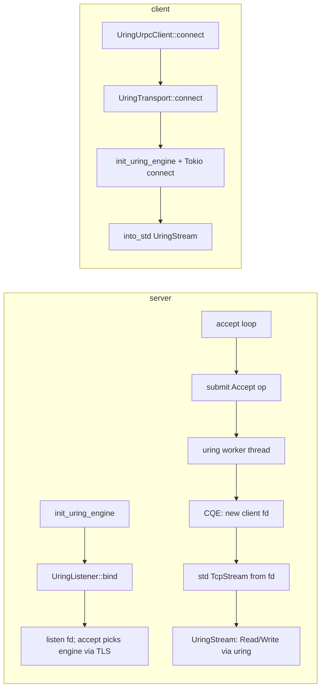

# RFC-01: urpc io-uring Transport

## 1. Background

`urpc` uses a `Transport` abstraction so upper layers (`Connection<S: TransportStream>`) stay independent of the I/O backend:

- **Default path**: `epoll` (Tokio `TcpListener` / `TcpStream`)
- **Linux optional path**: `io-uring` (Cargo feature: `io-uring`)

This document describes the **current** `io-uring` integration for **urpc network transport**. It does **not** cover disk I/O (`store/local/uring_io.rs`).

## 2. Design Goals

- Keep the `Transport` trait contract: `bind`, `connect`, `accept`, and stream `read` / `write` / `flush`.
- Avoid coupling protocol code to whether the listen side uses io_uring or epoll.
- Use **io_uring** for the **listen** socket and for **connected** TCP **read/write** (no Tokio epoll on the data fd), while still **awaiting** completions on Tokio worker threads.

## 3. Current Architecture (io_uring listen + read/write)

### 3.1 Rationale

Earlier iterations mixed **Tokio**-registered fds with **io_uring** on the same ring, or used a single ring for **all** op types without a clean completion model. The **current** design uses **one** io_uring worker thread per engine (`UringNetEngine`); each ring multiplexes **`Accept`**, **`IORING_OP_READ`**, and **`IORING_OP_WRITE`** on **non-blocking** sockets. **Connected** sockets are **`std::net::TcpStream` only** (no `tokio::net::TcpStream` for I/O): they are **not** registered with Tokio’s epoll reactor for read/write.

**Outbound connect** still uses **`tokio::net::TcpStream::connect`**, then **`into_std()`** to obtain a **non-blocking** `std::net::TcpStream` for uring I/O. **Clients** call **`init_uring_engine(0)`** lazily inside **`UringTransport::connect`** so standalone processes without `rpc` still get a ring pool.

| Phase | Mechanism |
|-------|-----------|
| **Listen / accept** | Submit **`IORING_OP_ACCEPT`** (multiplexed SQEs + `EAGAIN` resubmit). |
| **Connected socket I/O** | **`IORING_OP_READ` / `IORING_OP_WRITE`** on the socket `RawFd`; `read_buf` / `write_all` submit ops and **await** `oneshot` completions from the worker. |
| **Outbound client connect** | Tokio `TcpStream::connect` → **`into_std()`** → uring-backed read/write. |

### 3.2 Module Responsibilities

Core code: `riffle-server/src/urpc/transport/uring.rs`

| Component | Responsibility |
|-----------|------------------|
| `UringTransport` | `Transport::bind` (std `TcpListener` + non-blocking listen fd), `Transport::connect` (`init_uring_engine(0)?`, Tokio connect, `into_std`). |
| `UringListener` | Holds `TcpListener` + listen `RawFd`; `accept` submits **`Accept`**, then builds **`std::net::TcpStream`** from the new fd (non-blocking). |
| `UringStream` | Owns **`std::net::TcpStream`** + cached `peer`; **`read_buf` / `write_all` / `read_exact`** submit **Read/Write** ops to **`get_engine()`** (TLS-routed engine index). |
| `UringNetEngine` | `submit(op)` via `mpsc::SyncSender<UringOp>` to the worker thread. |
| **Worker** | `IoUring`, **`pending`** map by `user_data`, **`Accept` / `Read` / `Write`**, `submit_and_wait`, drain CQ, resubmit on `-EAGAIN`. |

There is **no** separate `UringWorker` type name in code; the loop is `uring_worker_loop`.

### 3.3 Component Diagram

```
┌─────────────────────────────────────────────────────────────────┐
│              Connection<S: TransportStream> (unchanged)            │
├─────────────────────────────────────────────────────────────────┤
│  Epoll path                    │  io-uring path (Linux + feature) │
│  EpollTransport / EpollStream  │  UringTransport / UringStream    │
│  (all Tokio TCP)               │  accept + read/write → io_uring  │
└─────────────────────────────────────────────────────────────────┘
```

### 3.4 Server vs Client Flow



**Note:** The **client** must have **`init_uring_engine`** run before any stream I/O; **`UringTransport::connect`** performs **`init_uring_engine(0)`** (no-op if the server in the same process already initialized the `OnceCell`).

## 4. Operation Lifecycle (Worker)

### 4.1 `UringOp` variants

- **`Accept`** — non-blocking listen fd; `sockaddr_storage` / `addrlen` from kernel; completion **`UringNotify::Int`**: new client fd (`i32 ≥ 0`) or negative errno (caller checks).
- **`Read`** — non-blocking connected socket; owned `Vec<u8>` buffer until CQE; completion **`UringNotify::Read`**: filled `Vec<u8>` (empty = EOF) or `Err`.
- **`Write`** — non-blocking connected socket; owned `Vec<u8>` payload; completion **`UringNotify::Int`**: bytes written (`i32`) or `Err` on failure (not `EAGAIN`).

### 4.2 Submit Path

1. Caller builds `UringOp`, `UringNetEngine::submit` → `SyncSender` (bounded queue).
2. Worker `try_recv`s or blocking `recv` when idle, assigns monotonic `user_data`, pushes SQE, tracks `pending`.
3. `submit_and_wait(1)`, drain all CQEs; for `-EAGAIN` / `-EWOULDBLOCK`, re-push the **same** SQE (same `user_data`).
4. On terminal result, `oneshot` notifies the async caller (`accept` maps fd → `std::net::TcpStream`; `read_buf` extends `BytesMut`; `write_all` loops partial writes).

### 4.3 Errors

- **`Accept`**: negative CQE (non-would-block) still delivered as `Ok(negative)` for compatibility; listener maps to `Err`.
- **`Read` / `Write`**: negative CQE (non-would-block) → `Err` on the `oneshot`.
- User-facing errors surface as `anyhow::Error` from `TransportStream` methods.

## 5. Threading and Concurrency

- **One** `IoUring` instance per **engine**: each engine runs in its own OS thread (`riffle-uring-net-{i}`) and optionally pins to `core_affinity::get_core_ids()[i]` when affinity is available (one logical core per engine for `i < core count`).
- **`UringEngineRegistry`** (`OnceCell`) holds a **`Vec` of `UringNetEngine`** — count from `init_uring_engine`: `threads == 0` means one engine per logical CPU (`logical_cpu_count` in `uring.rs`); `threads > 0` caps the pool size.
- **`thread_local` `URING_ENGINE_INDEX`**: used with `on_thread_start` in `rpc.rs` so Tokio worker threads pick a stable index; `get_engine()` maps that index to an `Arc` (modulo engine count).
- **Multiplexing** matters so one listener stuck in `Accept` `EAGAIN` does not prevent processing other `Accept` / `Read` / `Write` completions on the same ring.

Legacy designs (e.g. `Arc<Mutex<Receiver>>` across multiple workers) are **not** present; the channel is **`mpsc::sync_channel`** feeding **one** consumer.

## 6. API and Integration

### 6.1 Server (`rpc.rs`)

When `io_uring_enable = true` (and feature + Linux):

1. `init_uring_engine(threads)` — initializes the global registry + one worker thread (and ring) per engine.
2. Spawn a thread with a Tokio multi-thread runtime (core affinity hook calls `set_current_engine_index`).
3. `UringListener::bind(0.0.0.0:urpc_port)` then `urpc::server::run_with_listener`.

### 6.2 Client (`urpc/client.rs`)

- `UringUrpcClient::connect` → `UringTransport::connect`, which calls **`init_uring_engine(0)?`** before stream I/O (idempotent if the server already initialized the registry).

### 6.3 `get_engine()`

- `pub(crate)` — used by `UringListener::accept` and **`UringStream` read/write** (per-call routing so each Tokio worker submits to its TLS-selected engine).

## 7. Configuration

### 7.1 Feature Gate

```toml
[features]
io-uring = ["dep:io-uring"]
```

### 7.2 Server Config Example

```toml
[urpc_config]
get_index_rpc_version = "V2"
io_uring_enable = true
io_uring_threads = 0    # 0 = one engine per logical CPU; >0 caps engine count
```

### 7.3 `UrpcConfig` Fields (urpc)

| Option | Type | Default | Description |
|--------|------|---------|-------------|
| `get_index_rpc_version` | `RpcVersion` | `V1` | RPC version |
| `io_uring_enable` | `bool` | `false` | Use urpc io-uring listen path (Linux + feature) |
| `io_uring_threads` | `usize` | `0` | `0` = one engine per logical CPU; `>0` = max engines |

## 8. Performance Notes (Realistic)

**Listen** and **stream** I/O both go through **io_uring** on this path (not Tokio epoll for the data fd). Throughput still depends on **ring depth**, **engine count**, **`sync_channel` contention**, **copy** between `Vec` and `BytesMut` (current implementation), and **kernel** tuning. Profile before claiming wins vs epoll.

## 9. Limitations and Follow-ups

- **Multiple rings** when `logical_cpu_count > 1` (or when capped by `io_uring_threads`); each ring stays single-threaded.
- **Connect** still uses Tokio’s blocking connect helper; only post-connect traffic uses **`IORING_OP_READ`/`WRITE`**.
- **Copies**: `read_buf` / `write_all` use owned `Vec` chunks (up to 256 KiB) and extend/copy into `BytesMut` / from slices — room for **registered buffers** / **fixed files** / **direct `BytesMut` iov** later.
- **Cancellation**: operations are not cancelled on `Drop` of a pending future (same class of limitation as the previous hybrid).
- **`AsRawFd`**: `UringStream` uses `std::net::TcpStream` for the crate’s `transport::AsRawFd` trait.

## 10. Validation

```bash
cargo check -p riffle-server --features io-uring

# Integration tests (Linux + io-uring feature)
cargo test -p riffle-server --features io-uring --test write_read shuffle_write_read_testing_with_io_uring
cargo test -p riffle-server --features io-uring --test uring_simple
```

The `uring_simple` integration test is **`required-features = ["io-uring"]`** in `Cargo.toml`. It mirrors production patterns (real `sockaddr` for `Accept`, multiplexed `pending`, `Recv` roundtrip) — see `tests/uring_simple.rs`.

Recommended: compare behavior with epoll path under the same workload; monitor accept QPS and tail latency if tuning the listen path.

## 11. Possible Future Work

- **`IORING_OP_CONNECT`** or blocking connect offload if connect latency matters.
- **Registered buffers / `IORING_SETUP_IOPOLL`** (where appropriate) to cut copies and syscall overhead.
- **Cancellation** and safe `Drop` for in-flight SQEs.
- Metrics: worker queue depth, `EAGAIN` rate, bytes per read/write completion.

---

*Status: **Implemented** — listen + connected **`read`/`write`** via io_uring (`IORING_OP_ACCEPT` / `READ` / `WRITE`); Tokio is used for scheduling/`await` only, not epoll on the stream fd.*
