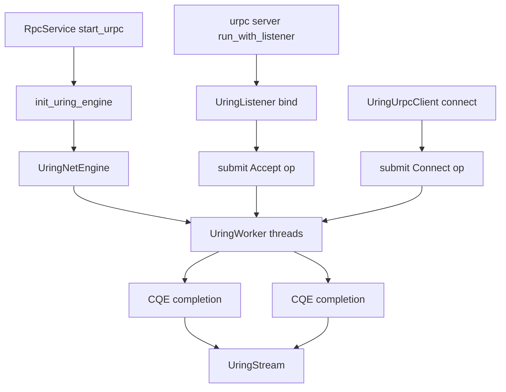

# RFC-01: urpc io-uring Transport

## 1. Background

`urpc` introduces a `Transport` abstraction in its network layer to decouple upper-layer request handling from the underlying I/O backend:

- **Default path**: `epoll` (tokio `TcpListener` / `TcpStream`)
- **Linux-optional path**: `io-uring` (feature: `io-uring`)

This document focuses on the `io-uring` design for **urpc network transport**. It does **not** cover the local disk I/O engine (`store/local/uring_io.rs`).

## 2. Design Goals

- Introduce an `io-uring` transport backend without modifying upper-layer protocol handling code in `Connection<S: TransportStream>`.
- Keep the `Transport` trait contract stable: `bind / connect / accept / read / write / flush`.
- First: make the feature-gated path compile, start, and perform basic read/write. Optimize later.

## 3. Architecture

### 3.1 Module Responsibilities

Core code lives in `urpc/transport/uring.rs`:

| Module | Responsibility |
|--------|---------------|
| `UringTransport` | `Transport` impl; provides `bind` and `connect` |
| `UringListener` | `TransportListener` impl; `accept` new connections; exposes `UringListener::bind()` for call-site compatibility |
| `UringStream` | `TransportStream` impl; handles `read_buf`, `read_exact`, `write_all`, `flush` |
| `UringNetEngine` | Global (TLS-hosted) submission entry point; exposes `submit(op)` |
| `UringWorker` | Background worker thread; holds `IoUring`; submits SQEs and collects CQEs |

### 3.2 Component Diagram

```
┌──────────────────────────────────────────────────────────────┐
│                    urpc Server / Client                      │
├──────────────────────────────────────────────────────────────┤
│                   Connection<S: TransportStream>              │
├──────────────────────────────────────────────────────────────┤
│      Transport trait              TransportListener trait     │
│           │                               │                   │
│           ▼                               ▼                   │
│    ┌──────────┐                   ┌──────────┐              │
│    │ Epoll    │                   │ Uring    │              │
│    │Transport │                   │Transport │              │
│    └────┬─────┘                   └────┬─────┘              │
│         │                               │                    │
│         ▼                               ▼                    │
│    ┌──────────┐                   ┌──────────┐              │
│    │ Epoll    │                   │ Uring    │              │
│    │Listener  │                   │Listener  │              │
│    └────┬─────┘                   └────┬─────┘              │
│         │                               │                    │
│         ▼                               ▼                    │
│    ┌──────────┐                   ┌──────────┐              │
│    │ Epoll    │                   │ Uring    │              │
│    │Stream    │                   │Stream    │              │
│    └──────────┘                   └──────────┘              │
└──────────────────────────────────────────────────────────────┘
```

### 3.3 High-level Flow



## 4. Operation Lifecycle

### 4.1 Submit Path

Each network operation is encapsulated in `UringOp`:

- `op_type`: one of `Accept | Connect | Recv | Send | Close`
- `tx`: `Option<oneshot::Sender<Result<i32>>>` (wrapped in `Option` so it can be `take()`n at completion time)

Call sequence:

1. `UringStream` / `UringListener` constructs an `UringOp`
2. `UringNetEngine::submit()` sends it through the `mpsc::SyncSender`
3. Worker(s) drain pending ops from the shared `Receiver`
4. Build SQE, submit to `IoUring`
5. Handle CQE, fill result back into the corresponding `oneshot`

### 4.2 Completion and Error

- CQE `result < 0` is mapped uniformly to an `anyhow` error.
- Caller obtains the result via `rx.await`, forming async semantics.
- `read_exact` treats a `0` return as a closed connection and returns an error.

## 5. Threading and Concurrency Model

### 5.1 Shared Receiver

The original approach tried to `Receiver::clone()` across workers, but `std::sync::mpsc::Receiver` is not cloneable, causing the feature to fail to compile.

The fix uses a shared receiver:

- `Arc<Mutex<mpsc::Receiver<UringOp>>>`
- Multiple workers compete to pull tasks.

This model is semantically correct and represents the minimum viable change.

### 5.2 Batching Behavior

- Each worker's local `pending` buffer is capped at 1024.
- Each round fills SQEs and calls `submit()` as much as possible.
- When no pending ops exist, the worker briefly `sleep(1ms)` to avoid busy-waiting.

## 6. API and Integration Contract

### 6.1 Server Side

When `io_uring_enable=true` and the feature is enabled, `rpc.rs`:

1. Calls `init_uring_engine(threads)`
2. Starts `UringListener::bind(addr)`
3. Enters `urpc::server::run_with_listener`

### 6.2 Client Side

`UringUrpcClient::connect()`:

- Initializes the engine if not already done
- Establishes the connection via `UringTransport::connect()`

### 6.3 Visibility Constraint

`get_engine()` is `pub(crate)` to allow client-side checks on engine initialization state.

## 7. Configuration

### 7.1 Feature Gate

```toml
[features]
io-uring = ["dep:io-uring"]
```

### 7.2 Server Config

```toml
[urpc_config]
get_index_rpc_version = "V2"
io_uring_enable = true
io_uring_threads = 2   # optional, defaults to 2
```

### 7.3 UrpcConfig Options

| Option | Type | Default | Description |
|--------|------|---------|-------------|
| `get_index_rpc_version` | `RpcVersion` | `V1` | RPC version |
| `io_uring_enable` | `bool` | `false` | Enable io-uring (Linux only) |
| `io_uring_threads` | `usize` | `2` | Number of io-uring worker threads |

## 8. Compile-fix Mapping (Current Round)

The following fixes were required to make `--features io-uring` compile:

| # | Issue | Fix |
|---|-------|-----|
| 1 | `mpsc::Receiver` is not cloneable | Share receiver via `Arc<Mutex<_>>` |
| 2 | `UringListener::bind` not accessible | Add `UringListener::bind(addr)` delegating to `UringTransport::bind` |
| 3 | `get_engine` was private | Change to `pub(crate) fn get_engine` |
| 4 | `sq.push` type mismatch | Pass by reference: `sq.push(&sqe.user_data(...))` |
| 5 | `oneshot::Sender` moved out of shared reference at completion | Change `tx` to `Option<Sender<_>>` + `take()` |
| 6 | Ambiguous `UrpcClient::connect` in `mini_riffle` with both backends enabled | Use explicit `EpollUrpcClient` there |

## 9. Performance Expectations

| Scenario | epoll | io-uring |
|----------|-------|----------|
| Small data read/write | Good | Good |
| Large data transfer | Good | Excellent (fewer syscalls) |
| High-concurrency connections | Good | Excellent (batching) |
| CPU usage | Medium | Low |

## 10. Known Limitations and Risks

The following do not block compilation but are recommended for the next iteration:

- **`user_data` index mapping is fragile**
  - Currently derived from pointer offset arithmetic; maintenance cost is high and edge-case behavior needs stricter justification.
- **Shared `Receiver` with `Mutex` may become a bottleneck under high concurrency**
  - Could affect throughput and tail latency at high connection density.
- **Worker idle strategy `sleep(1ms)` is a simple back-off**
  - Not ideal for extreme low-latency scenarios.
- **Error semantics are coarse-grained**
  - Negative errno to upper-layer error classification can be further refined for better observability.

## 11. Validation Checklist

Minimum verification:

```bash
cargo check
cargo check -p riffle-server --features io-uring
```

Recommended follow-up verification:

- End-to-end startup + connection regression with `io_uring_enable=true`
- `get_local_shuffle_data` result consistency comparison between `epoll` and `io-uring`
- Error rate and P99 latency observation under concurrent load

## 12. Next Iteration Proposal

### P0

- Replace the `user_data` mapping scheme to avoid pointer-offset arithmetic.
- Enrich completion error classification with log context (op type, fd, errno).

### P1

- Evaluate a lock-free MPSC queue or per-worker dedicated queues to reduce shared lock contention.
- Introduce a more granular wait/park strategy to reduce idle polling overhead.
- Add unit and integration tests specific to the `io-uring` path.

---

*Status: Draft — pending review and approval of the direction.*
